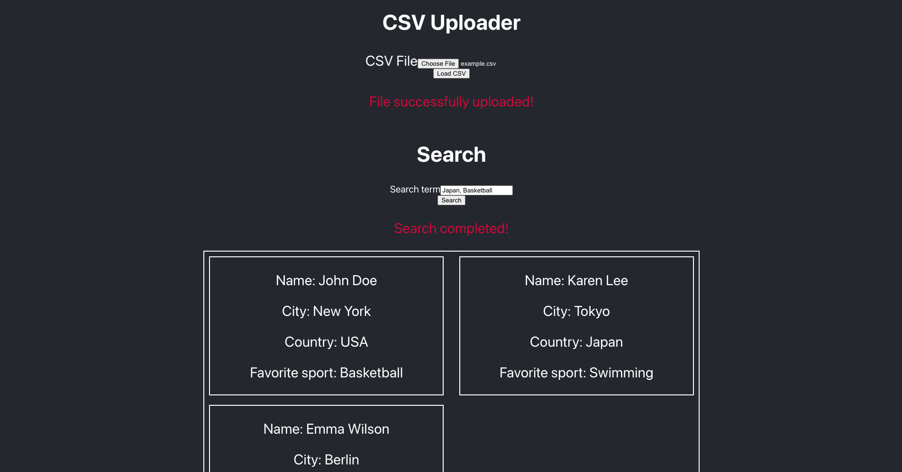

# shaw-csv-frontend
SPA in React to load and query CSV

## About
This frontend project loads CSV files and display each row as cards on the page.
It also has a search bar to search for data within the loaded CSV.

## Built with

- React.js
- Create React App
- Jest

## Setup

*** This frontend project depends on the backend, located at [shaw-csv-backend](https://github.com/arthurborgesdev/shaw-csv-backend), do the Setup in there first ***

- Get the link of the repository: `git@github.com:arthurborgesdev/shaw-csv-frontend.git`
- Clone it as `git@github.com:arthurborgesdev/shaw-csv-frontend.git` on a Terminal
- Change directory to it by `cd shaw-csv-frontend`
- Run `npm i` on a Terminal
- Run `npm start`
- Open the website at `localhost:4000` or `127.0.0.1:4000`

### Tests

To run tests, run in a separated Terminal tab: `npm test`

Launches the test runner in the interactive watch mode.\
See the section about [running tests](https://facebook.github.io/create-react-app/docs/running-tests) for more information.

### Usage

- Load a .csv valid file (The system will not allow empty or not .csv files)
- Cards will be loaded, each card for each row in the CSV file
- After the CSV is loaded, search between loaded cards using terms separated by commas, like "London" or "London, Basketball" or "London,Basketball"

## Author

👤 **Arthur Borges**